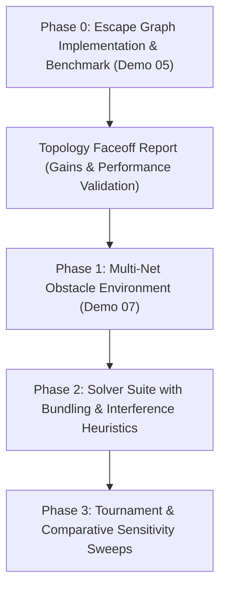

# Implementation Plan - Escape Graph Benchmarking (Demo 05) & Multi-Net Obstacle Routing (Demo 07)

We will execute **Phase 0: Escape Graph Benchmarking** in **Demo 05** as the mandatory topological foundation before building **Demo 07: Multi-Net Obstacle Routing**. This ensures that we make an evidence-based decision on our primary grid representation (Escape Graphs vs. Hanan Grids) following our "Clean Research" and "Theoretical Foundation" mandates (*Blokland, 2023*).

---

## Strategic Roadmap

---

## Phase 0: Escape Graph Foundation & Benchmarking (Demo 05)

### 1. Research Goal
Empirically prove that **Escape Graphs (EGs)** significantly reduce node/edge counts and pathfinding latency compared to dense **Hanan Grids** without sacrificing the optimality of the resulting Rectilinear Steiner Tree (RSTPO).

### 2. Algorithmic Specification: Escape Graph Construction
For a given set of terminals $S$ and rectangular obstacles $O$:
1.  **Interest Points:** The set of interest points $P_{\text{interest}} = S \cup \{ \text{corners of } o \mid o \in O \}$.
2.  **Orthogonal Ray Tracing:** For each point $p = (x, y) \in P_{\text{interest}}$, project four rays in orthogonal directions (North, South, East, West).
3.  **Ray Termination:** A ray terminates at:
    *   The first intersection with a static obstacle boundary.
    *   The global bounding box boundary (with a padding margin, e.g., 80 units).
4.  **Nodes:** The vertices of the Escape Graph are all interest points plus all ray termination points and ray intersection points.
5.  **Edges:** Connect vertices that are adjacent along any traced ray, provided the segment does not lie strictly inside or intersect any obstacle.

### 3. Implementation Plan for Demo 05

#### [NEW] `demos/05-manhattan-obstacles/environment.py` (Parallel Class)
*   **Safety Rule:** Do NOT modify `GridEnvironment`. Implement `EscapeGraphEnvironment` as a new parallel class in `environment.py`.
*   Supports matching interfaces: `nodes`, `n_nodes`, `node_map`, `dist_matrix`, `predecessors`, `get_path()`.

#### [NEW] [topology_faceoff.py](file:///C:/DEV/MEP/demos/05-manhattan-obstacles/data_exploration/topology_faceoff.py)
*   Create a clean, isolated benchmarker script.
*   **Non-Destructive Logging:** Initializes and writes to `topology_benchmark.db`. The historical `benchmark_results.db` is strictly READ-ONLY.
*   **Sweep Design:** 
    *   Generate random maps with rectangular obstacles.
    *   Sweep terminal counts $N = 20, 30, 40, 50, 60, 70, 80, 90, 100$ (3 trials per $N$ with different seeds).
    *   For each trial, execute both `GridEnvironment` (Hanan) and `EscapeGraphEnvironment` (EG), and solve using the same Steiner solver.
    *   Log KPIs: `node_count`, `edge_count`, `apsp_time_ms`, `solver_time_ms`, `total_path_weight`.

#### [NEW] [topology_report.md](file:///C:/DEV/MEP/demos/05-manhattan-obstacles/data_exploration/topology_report.md)
*   Compile a structured research report summarizing the sweeps:
    *   **Reason:** The theoretical basis for Escape Graphs in literature (reducing grid complexity from $O(|S|^2)$ to $O(|S| + |O|)$ in sparse regions).
    *   **Methodology:** The sweep details.
    *   **Takeaway:** Empirical ratios of node reductions, speedups, and confirmation of identical path weights.

---

## Phase 1: Demo 07: Multi-Net Obstacle Routing

Once Phase 0 is validated and approved, we will build **Demo 07** in `demos/07-multi-net-obstacles/` utilizing the winning topology (EG or Hanan) as our primary environment.

### 1. Environment Specifications (`environment.py`)
*   Supports **Multi-Net Dynamic Locking** (locked edges/nodes representing routed paths).
*   **Bundling Discount:** Computes a potential well attraction factor $\eta_{\text{bundle}} \in [0.70, 0.85]$ for edges that run parallel and adjacent to already-routed paths.
*   **Bounded Search Area (BSA):** Limits routing queries to localized detour bounding boxes.
*   **Dynamic Escape Graph Augmentation**: For sequential multi-net routing:
    *   When routing Net $k$, treat previously routed paths (Nets $1 \dots k-1$) as dynamic obstacles.
    *   Augment the escape graph by dynamically projecting orthogonal rays from the elbows/vertices of the already-routed paths.
    *   This guarantees that the routing grid dynamically adapts to introduce parallel grid lines wrapping tightly around existing pipes, allowing for close packaging and preventing local grid-alignment failures.

### 2. Solver Specifications (`solver.py`)
*   **Interference-Degree Priority Queue:** Ranks nets using:
    $$I_i = \alpha \cdot \text{Area}(BB_i) + \beta \sum_{j \neq i} \text{Overlap}(BB_i, BB_j) + \gamma \cdot N_{\text{terminals\_overlap}}$$
*   **Staged Pipeline Solver:** Drafting $\rightarrow$ Coordination (Negotiated / Rip-up) $\rightarrow$ Steiner Polishing.

---

## Verification Plan (Phase 0)

### Automated Verification
*   `pytest demos/05-manhattan-obstacles/` to ensure:
    *   `EscapeGraphEnvironment` builds without syntax errors.
    *   `n_nodes` in `EscapeGraphEnvironment` is strictly less than or equal to `GridEnvironment`.
    *   Pathfinder returns identical or lower total weights (proving no loss in Steiner optimality).

### Manual Verification
*   Execute `python topology_faceoff.py` and inspect `topology_report.md` to confirm node reduction ratios (target: $\ge 40\%$ reduction in dense obstacle maps) and speedups (target: $\ge 2\text{x}$ APSP speedup).
