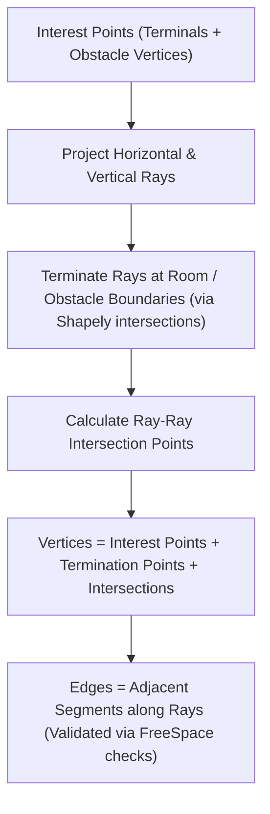

# Implementation Plan: Bend-Aware Non-Orthogonal Routing (Demo 08)

This document outlines the design and implementation strategy for **Demo 08: Bend-Aware Non-Orthogonal Routing**. The objective is to optimize for both path length and turn counts in environments with non-grid-aligned obstacles and non-square rooms, utilizing `shapely` for geometric validation.

---

## 1. Research Objectives & Scope
1.  **Arbitrary Geometries:** Support rooms and obstacles defined as arbitrary polygons (non-square rooms, rotated/tilted obstacles) instead of axis-aligned rectangles.
2.  **Turn Minimization ($C_{\text{bend}}$):** Implement routing heuristics that minimize the number of $90^\circ$ bends (turns) rather than just physical length.
3.  **Solver Comparison:** Compare two distinct philosophies:
    *   **Native Bend-Aware Routing:** Graph search that optimizes length + bend penalties simultaneously using state-expansion.
    *   **Post-Process Turn Cleanup:** Standard fast routing (e.g., FastCorner) followed by a geometric post-processing pass that attempts to align and straighten segments.
4.  **Scenarios:** Test both **two-terminal** (point-to-point) routing and **multi-terminal** (Steiner tree) routing.

---

## 2. Geometric Representation (`shapely`)
We will use Python's `shapely` library to model the continuous space:
*   **Room:** A single `shapely.Polygon` (can be L-shaped, T-shaped, or general polygon).
*   **Obstacles:** A list of `shapely.Polygon` objects representing columns, diagonal walls, or circular structural elements (approximated by polygons).
*   **Free Space:** The topological routing area is defined as:
    $$\text{FreeSpace} = \text{Room} \setminus \bigcup_{o \in \text{Obstacles}} o$$
*   **Validity Check:** A candidate segment $[p_1, p_2]$ is valid if and only if:
    1.  It lies entirely within the `Room` polygon.
    2.  It does not intersect the interior of any `Obstacle` polygon.
    3.  `shapely.LineString([p1, p2]).within(FreeSpace)` returns `True`.

---

## 3. Graph Construction on Non-Grid Space
Because obstacles are not grid-aligned, a simple rectangular Hanan Grid is insufficient. We will implement a **Generalized Orthogonal Grid Builder**:

This constructs a boundary-conforming orthogonal routing grid that guarantees rectilinear paths can wrap closely around diagonal/rotated obstacles.

---

## 4. Algorithmic Specifications

### 4.1 Turn-Minimizing State-Expanded Pathfinder
We will implement an $A^*$ pathfinder that runs on a state space where each node is a tuple `(node_index, incoming_direction)`:
*   **Directions:** $\{ \text{North}, \text{South}, \text{East}, \text{West}, \text{None} \}$.
*   **State transitions:** From `(u, dir_1)` to `(v, dir_2)`:
    *   `dir_2` is the direction of vector $v - u$.
    *   If `dir_1 != dir_2` and `dir_1 != None`: apply penalty $C_{\text{bend}}$ to the cost.
*   **Heuristic Function:** A bend-aware Manhattan distance heuristic:
    $$h( (v, \text{dir}), \text{target} ) = \text{ManhattanDist}(v, \text{target}) + C_{\text{bend}} \cdot \text{EstTurns}(v, \text{dir}, \text{target})$$
    where $\text{EstTurns}$ estimates if we must turn to reach the target from our current direction.

### 4.2 Native Bend-Aware Steiner Solver (`BendAwareKMB`)
1.  Compute the turn-penalized All-Pairs Shortest Paths (APSP) between terminals using the state-expanded pathfinder.
2.  Construct the metric closure.
3.  Compute the MST on the metric closure.
4.  Expand MST edges back to physical paths, deduplicate trunks, and run a degree-based leaf pruner.

### 4.3 Post-Process Turn Cleanup Heuristic (`TurnCleanupSolver`)
1.  **Base Routing:** Solve using standard **FastCorner** or KMB without bend penalties (pure length optimization).
2.  **Cleanup Pass:** Run an iterative segment-shifting algorithm:
    *   For every degree-2 elbow bend $v_i$ between segments $S_1$ and $S_2$:
        *   Attempt to shift the horizontal/vertical line coordinates to merge the bend with an adjacent parallel segment.
        *   Validate each shift using `shapely` to ensure the shifted segment does not intersect any obstacles.
        *   If valid and it reduces/eliminates turns, commit the shift.

---

## 5. Verification & Sensitivity Analysis
We will evaluate the solvers against three KPIs:
1.  **Total Path Weight** (true physical length).
2.  **Turn Count** (number of $90^\circ$ bends).
3.  **Solving Time** (ms).

By sweeping $C_{\text{bend}}$ from $0$ (pure length) to $1000$ (high bend penalty), we will plot the Pareto Frontier of **Length vs. Turns** to find the optimal trade-off point for piping coordinates.
