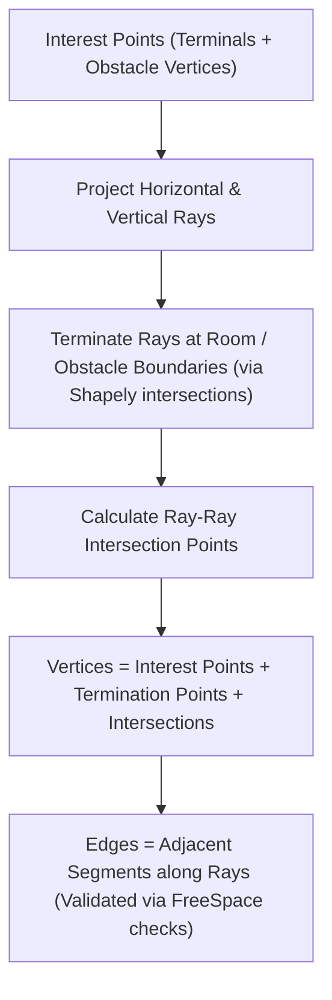

# Implementation Plan: Bend-Aware Non-Orthogonal Routing (Demo 08)

This document outlines the design and implementation strategy for **Demo 08: Bend-Aware Non-Orthogonal Routing**. The objective is to optimize for both path length and turn counts in environments with non-grid-aligned obstacles and non-square rooms, utilizing `shapely` for geometric validation.

---

## 1. Research Objectives & Scope
1.  **Arbitrary Geometries:** Support rooms and obstacles defined as arbitrary polygons (non-square rooms, rotated/tilted obstacles) instead of axis-aligned rectangles.
2.  **Turn Minimization ($C_{\text{bend}}$):** Implement routing heuristics that minimize the number of $90^\circ$ bends (turns) rather than just physical length.
3.  **Solver Comparison:** Compare two distinct philosophies:
    *   **Native Bend-Aware Routing:** Graph search that optimizes length + bend penalties simultaneously using state-expansion.
    *   **Post-Process Turn Cleanup:** Standard fast routing (e.g., FastCorner) followed by a geometric post-processing pass that attempts to align and straighten segments.
4.  **Scenarios:** Test both **two-terminal** (point-to-point) routing and **multi-terminal** (Steiner tree) routing.

---

## 2. Geometric Representation (`shapely`)
We will use Python's `shapely` library to model the continuous space:
*   **Room:** A single `shapely.Polygon` (can be L-shaped, T-shaped, or general polygon).
*   **Obstacles:** A list of `shapely.Polygon` objects representing columns, diagonal walls, or circular structural elements (approximated by polygons).
*   **Free Space:** The topological routing area is defined as:
    $$\text{FreeSpace} = \text{Room} \setminus \bigcup_{o \in \text{Obstacles}} o$$
*   **Validity Check:** A candidate segment $[p_1, p_2]$ is valid if and only if:
    1.  It lies entirely within the `Room` polygon.
    2.  It does not intersect the interior of any `Obstacle` polygon.
    3.  `shapely.LineString([p1, p2]).within(FreeSpace)` returns `True`.

---

## 3. Graph Construction on Non-Grid Space (Escape Graph)
Because obstacles are not grid-aligned, a simple rectangular Hanan Grid is insufficient. We implement a **Generalized Orthogonal Grid Builder** (which functions as a static escape graph):

This constructs a boundary-conforming orthogonal routing grid that guarantees rectilinear paths can wrap closely around diagonal/rotated obstacles.

### ❓ Does the Escape Graph depend on the starting point?
* **Global/Static Escape Graph (Used Here)**: We project rays from all terminals and obstacle corners simultaneously. Thus, **the escape graph does not depend on the starting point** of any specific point-to-point query. It is precompiled once, allowing us to perform fast All-Pairs Shortest Path (APSP) computations.
* **Local/Dynamic Escape Graph (Alternative)**: If rays were projected only from the active terminals/paths during routing, **the graph would depend on the starting point**. While it keeps the graph smaller for single paths, it requires dynamic geometric rebuilds for each search, which is computationally expensive for multi-terminal routing.

---

## 4. Algorithmic Specifications

### 4.1 Turn-Minimizing State-Expanded Pathfinder
We will implement an $A^*$ pathfinder that runs on a state space where each node is a tuple `(node_index, incoming_direction)`:
*   **Directions:** $\{ \text{North}, \text{South}, \text{East}, \text{West}, \text{None} \}$.
*   **State transitions:** From `(u, dir_1)` to `(v, dir_2)`:
    *   `dir_2` is the direction of vector $v - u$.
    *   If `dir_1 != dir_2` and `dir_1 != None`: apply penalty $C_{\text{bend}}$ to the cost.
*   **Heuristic Function:** A bend-aware Manhattan distance heuristic:
    $$h( (v, \text{dir}), \text{target} ) = \text{ManhattanDist}(v, \text{target}) + C_{\text{bend}} \cdot \text{EstTurns}(v, \text{dir}, \text{target})$$
    where $\text{EstTurns}$ estimates if we must turn to reach the target from our current direction.

### 4.2 Native Bend-Aware Steiner Solver (`BendAwareKMB`)
1.  Compute the turn-penalized All-Pairs Shortest Paths (APSP) between terminals using the state-expanded pathfinder.
2.  Construct the metric closure.
3.  Compute the MST on the metric closure.
4.  Expand MST edges back to physical paths, deduplicate trunks, and run a degree-based leaf pruner.

### 4.3 Post-Process Turn Cleanup Heuristic (`TurnCleanupSolver`)
1.  **Base Routing:** Solve using standard **FastCorner** or KMB without bend penalties (pure length optimization).
2.  **Cleanup Pass:** Run an iterative segment-shifting algorithm:
    *   For every degree-2 elbow bend $v_i$ between segments $S_1$ and $S_2$:
        *   Attempt to shift the horizontal/vertical line coordinates to merge the bend with an adjacent parallel segment.
        *   Validate each shift using `shapely` to ensure the shifted segment does not intersect any obstacles.
        *   If valid and it reduces/eliminates turns, commit the shift.

### 4.4 Directed Dual Graph (Line Graph $L(G)$) Solver (`BendAwareDualGraphKMBSolver`)
To avoid dynamic state-expansion during pathfinding, we can construct the Directed Dual Graph (Line Graph) $L(G) = (V_L, E_L)$ of the routing grid $G = (V, E)$:
1.  **Vertices $V_L$**: For each undirected edge $e = (u, v) \in E$, create two directed nodes `(u, v)` and `(v, u)` representing traversal of the edge in both directions.
2.  **Edges $E_L$**: Connect node `(u, v)` to node `(v, w)` for all neighbors $w$ of $v$ in $G$ such that $w \neq u$.
3.  **Edge Weights**: The weight of transition `(u, v) -> (v, w)` is:
    $$\text{Weight} = \text{Length}(v, w) + C_{\text{bend}} \cdot \text{TurnPenalty}( (u, v), (v, w) )$$
    where $\text{TurnPenalty}$ is 1 if direction of $u \to v$ differs from $v \to w$, and 0 otherwise.
4.  **Pathfinding on $L(G)$**: For start terminal $s$ and target terminal $t$:
    *   Initialize Dijkstra/A* queue with all directed states `(s, v)` for neighbors $v$ of $s$, setting $g(\text{start}) = \text{Length}(s, v)$.
    *   The destination target is any state `(u, t)` where $u$ is a neighbor of $t$.
    *   Use the same turn-aware Manhattan distance heuristic to target $t$.
    *   Reconstruct the shortest path from the traversed $L(G)$ node sequence.

### 4.5 Directed Dual Graph Greedy Best-First Search (GBFS) Solver (`BendAwareDualGraphGBFSSolver`)
To explore the trade-off between path quality and search space size (expanding fewer nodes), we introduce a Greedy Best-First Search (GBFS) pathfinder on the Directed Dual Graph $L(G)$:
1.  **Search Priority**: The priority queue is sorted purely by the heuristic value $h(n)$ estimating the cost/turns to the target, ignoring the cost $g(n)$ paid so far.
2.  **Trade-offs**:
    *   *Advantage*: Extremely fast because the search focuses directly on the target, resulting in minimal node expansions.
    *   *Disadvantage*: Suboptimal paths (higher length or turn counts) because it does not guarantee finding the shortest turn-penalized path.
3.  **KMB Solver Integration**: Build the metric closure using this GBFS pathfinder on $L(G)$ instead of A*, compute the MST, expand the subgraph, and prune.

### 4.6 Dual Graph FastCorner Solver (`BendAwareDualGraphFastCornerSolver`)
Same logic as the state-expanded FastCorner solver, but evaluating candidate Steiner node insertions using the directed dual graph pathfinder `dual_graph_astar` instead of `state_expanded_astar` to construct the metric closure MST.

### 4.7 Dual Graph GBFS FastCorner Solver (`BendAwareDualGraphGBFSFastCornerSolver`)
Same logic as the state-expanded FastCorner solver, but using the fast `dual_graph_gbfs` pathfinder to build the metric closure MST and evaluate candidate nodes.

### 4.8 State-Expanded Sequential FastCorner Solver (`StateExpandedSequentialFastCornerSolver`)
To achieve $O(K \cdot N \log N)$ complexity rather than $O(\text{candidates} \times K^2)$ of KMB-based sweeps, we implement a sequential constructive tree-growing solver on the state-expanded graph:
1.  **Initialize**: Set tree nodes $T_V = \{t_1\}$ and tree segments $T_E = []$ using the first terminal.
2.  **Sequential Routing**: For each subsequent terminal $t_i$:
    *   Find the shortest path from $t_i$ to any vertex in the active tree $T_V$ using a multi-target state-expanded A* search.
    *   Add the nodes along the path to $T_V$ and the segments to $T_E$.
3.  **Refinement / Steiner Insertion**: For each corner candidate $c$, if $c$ can connect to three nodes in $T_V$ and reduce the overall length + turn cost, $c$ is added as a junction.

### 4.9 Dual Graph Sequential FastCorner Solver (`DualGraphSequentialFastCornerSolver`)
Same logic as `StateExpandedSequentialFastCornerSolver`, but routing terminals sequentially using a multi-target A* search on the directed dual graph $L(G)$ to connect to the active tree states.

---

## 5. Verification & Sensitivity Analysis
We will evaluate the solvers against three KPIs:
1.  **Total Path Weight** (true physical length).
2.  **Turn Count** (number of $90^\circ$ bends).
3.  **Solving Time** (ms).

By sweeping $C_{\text{bend}}$ from $0$ (pure length) to $2000$ (high bend penalty), we will benchmark state-expanded A* vs. explicit Directed Dual Graph A* vs. Dual Graph GBFS vs. KMB FastCorner vs. Sequential FastCorner to compare execution speed and correctness, plotting the Pareto Frontier of **Length vs. Turns** for all solvers.

### 5.1 Complex Geometry Scenario
To stress-test solver scalability and path quality in complex topologies, we define a **Winding Corridor Layout**:
*   **Room Boundaries**: A winding corridor shape (approx. $1200 \times 1200$ coordinate space) with 12 vertices.
*   **Rotated Obstacles**: 7 distinct obstacles positioned along the corridors, with size variations and non-orthogonal rotations (e.g. $15^\circ, -30^\circ, 45^\circ, 60^\circ, -15^\circ, 75^\circ, 30^\circ$).
*   **Terminals**: 6 terminals distributed across the different rooms/hallways.
*   **Expected Grid Complexity**: Over 600 nodes, creating a much larger state space for routing. Due to the size, top-down pruning (`BendAwarePrune`) will be disabled in the default benchmark sweep to prevent performance timeouts, while sequential and dual-graph solvers will serve as the primary efficient alternatives.

